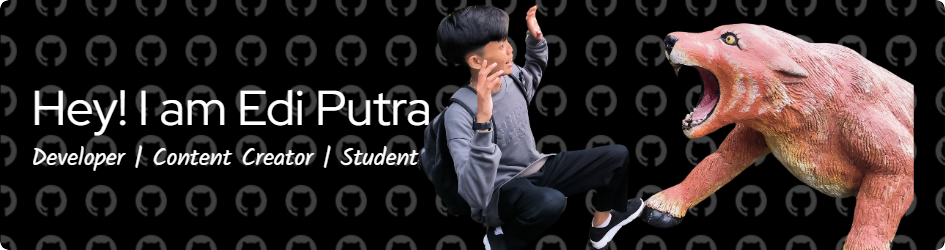

<h2 align="left">Hello World!! I'm Edi Putra 👋</h2>

<h4 align="left">Student | Developer | Content Creator</h4>

###

  
  
  

###

 

  
  
  

###

  
  
  
  
  
  
  
  
  
  
  
  
  

###

###

 

  

###